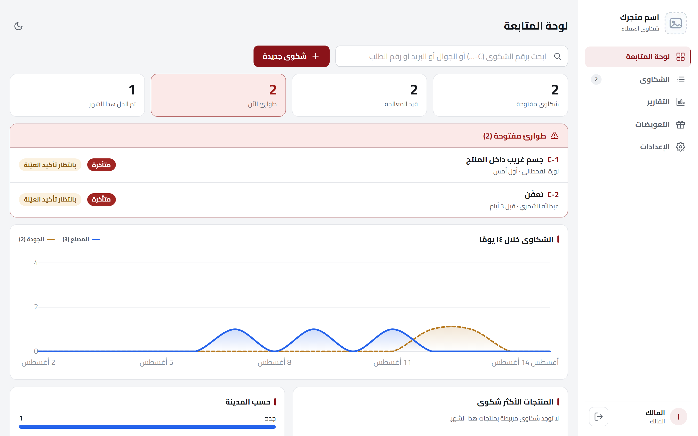
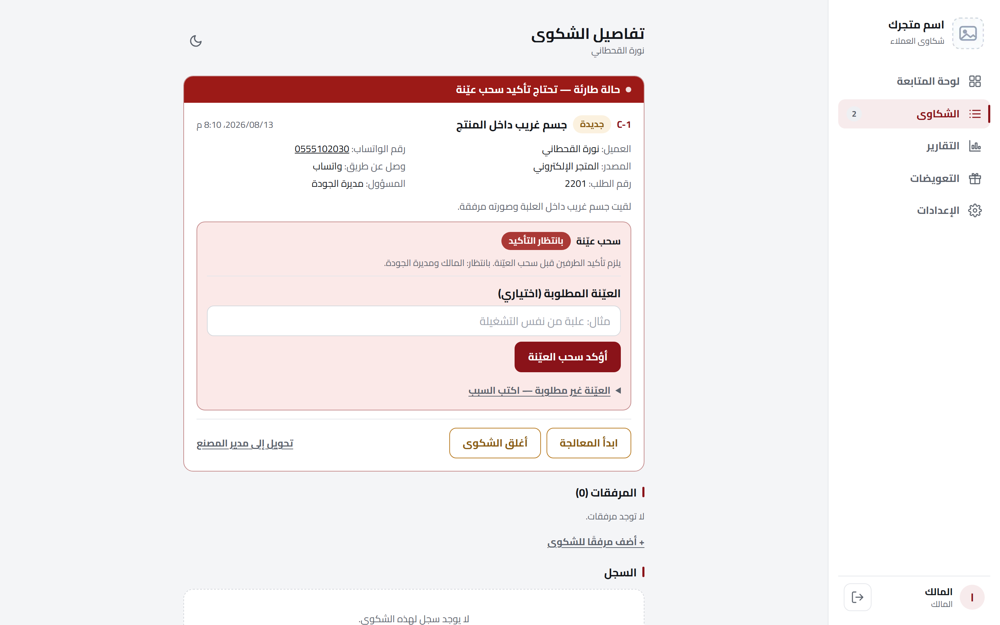
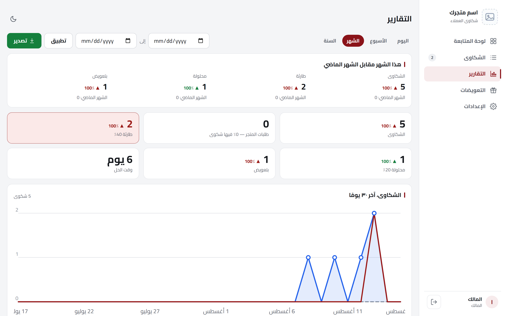

[English](README.md) · **العربية**

# نظام إدارة شكاوى العملاء

منصّة متعددة المستأجرين لإدارة شكاوى العملاء، عربية بالكامل، مبنية للسوق السعودي — من استقبال الشكوى
إلى حلّها إلى تقارير آخر الشهر، والشكوى الحرجة ما تضيع بين الباقي.

**🔗 النسخة التجريبية:** https://complaints-saas-demo.vercel.app
**الدخول:** `cs@demo.local` / `demodemo1234`

تصميم وتطوير كامل: **محمد الطونسي** — [LinkedIn](https://www.linkedin.com/in/mohammed-altounsi/)

---

## لقطات من النظام

| لوحة المتابعة | تفاصيل الشكوى | التقارير |
|---|---|---|
|  |  |  |

## وش يسوي

- **طابور الطوارئ** — الشكاوى الحرجة تطلع فوق كل شيء
- **متابعة المهلة** — كل شكوى لها مهلة رد، والمتأخر يتأشّر عليه تلقائيًا
- **توجيه ذكي** — كل شكوى تروح للقسم المسؤول (المصنع / الجودة / خدمة العملاء)
- **سجل التعويضات** — كل حل وتعويضه مسجّل وقابل للتقرير
- **التقارير** — تفصيل حسب المدينة والنوع والمنتج، مع لوحة متابعة حيّة
- **تكامل مع سلة** — بيانات الطلب توصل عبر الـ Webhooks، ومزامنة ليلية كخطّ احتياطي

## التقنيات

`Next.js 16 (App Router, Server Actions)` · `Supabase / Postgres` · `Vercel` · `TypeScript` · `Tailwind` · `PostHog (EU)`

## الأمان

- عزل الصفوف (RLS) يفصل بيانات كل متجر على مستوى قاعدة البيانات نفسها
- صور الشكاوى عبر روابط موقّعة تنتهي صلاحيتها — لا مخازن مفتوحة للعامة
- سياسة CSP صارمة، و`frame-ancestors 'none'` تمنع الاختطاف البصري للأزرار الحسّاسة
- مفاتيح التكامل مشفّرة عند التخزين (AES-GCM، مفتاح لكل متجر)
- لا خرائط مصدر (source maps) في الإنتاج، وترويسة إصدار الإطار مخفيّة

---

> الشيفرة المصدرية خاصّة — هذا المستودع للعرض فقط. لو تبي جولة في النظام أو نسخة تجريبية مفصّلة على متجرك،
> تواصل معي على [LinkedIn](https://www.linkedin.com/in/mohammed-altounsi/).

